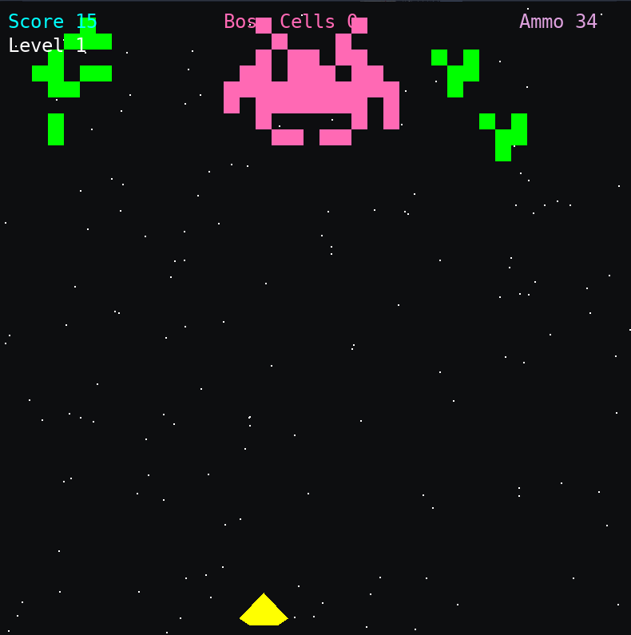

# Conway-game-of-life-invaders

Written in python, an arcade shooter that merges the classic gameplay of Space Invaders with the evolving patterns of cellular automata. 
<div align="center">

</div>

---

## Description

This project is an interactive arcade shooter, developed in Python with the Pygame library, that implements John Conway's Game of Life as the core enemy mechanic. It serves as a practical demonstration of cellular automata within a real-time application.

## Features

Evolving Enemies: The primary antagonists are not pre-programmed sprites but cellular automata patterns that evolve according to the rules of Conway's Game of Life.

Dynamic Boss Battle: A challenging boss encounter is triggered, featuring a large pattern whose "health" is a live count of its active cells, allowing it to regenerate or decay based on the simulation.

Multiple Game Modes: After completing the primary objective, the simulation can be reset to include the boss challenge again or run in an endless "sandbox" mode without the boss.


## Requirements

-   Python 3
-   Pygame

## How to Install and Run

1.  **Ensure you have Python 3 installed.** You can download it from [python.org](https://www.python.org/).

2.  **Install the Pygame library.** Open your terminal or command prompt and run the following command:
    ```bash
    pip install pygame
    ```

3.  **clone the repo.** Clone the repository and execute the main script from your terminal.

    ```bash
    git clone URL
    ```

4.  **Run the Game.** Navigate to the directory where you saved the file and run it from your terminal:
    ```bash
    python conway_invaders.py
    ```

### Controls

-   **Move Ship:** `Left Arrow` / `Right Arrow`
-   **Fire Standard Gun:** `Z`
-   **Fire Super Weapon (5-shot spread):** `X`
-   **Pause/Unpause Game:** `P`
-   **Toggle Help Screen:** `H`
-   **Quit Game:** `Q`


## Credits

-   **Original Concept:** This game is a Python and Pygame port inspired by the C++ and OpenGL "Conway Invaders" created by 
-   **Python Port:** Developed and enhanced with new features like the dynamic boss battle and multiple game modes.
